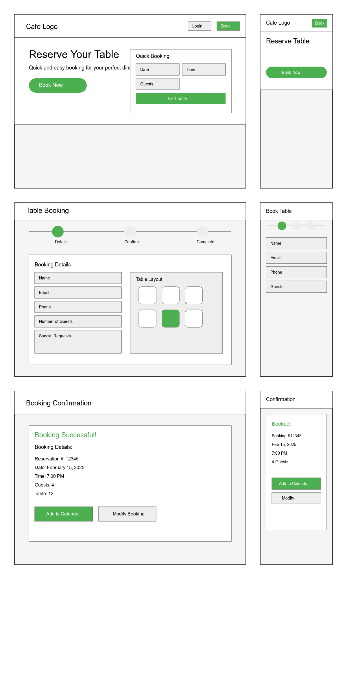
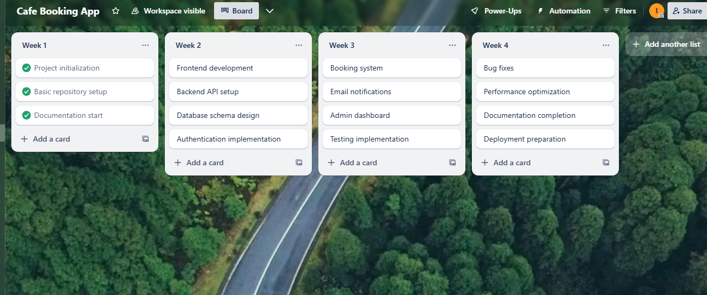

# Cafe_Table_Booking_Aplication

GitHubRepo Link: https://github.com/insearchwhy/Cafe_Table_Booking_Aplication

## Purpose 

 A Café Table Booking System web application designed to streamline the reservation process for both customers and staff at local cafés. 
 This system addresses the common challenges of manual booking, phone reservations, and walkins uncertainty by providing a digital solution that operates 24/7.

 # Features and Functionality

 ## Online Reservation System

- Real-time table availability checking
- Automated confirmation emails
- Time slot selection
- Group size

## User Management

- Creation Of Customer Profiles
- Booking history 
- Password reset functionality
- Prefrences

## Admin Dashboard

- Interface for Table Management 
- Overview of reservations
- Customer database
- Analytics and reporting

## Notification System

- Automatic booking confirmations
- Reminder emails
- Cancellation notifications
- Custom messaging system (possibly)

# Target Audience

## Primary Users (Customers)

- Local residents looking to book
 - Groups organizing a gatherings
- Regular café patrons

## Secondary Users (Staff)

- Managers
- Front-of-house staff
- Admin

# Tech Stack

## Frontend

- React.js
- TailwindCSS
- React Router
- Context API

## Backend

-Node.js
- Express.js
- MongoDB
- JWT Authentication

## DevOps

- Git
- Docker 

# Dataflow Diagram

# Application Architecture Diagram

# User Stories 

## Customer Stories

- "I'm a busy professional. I need to book a table outside work hours to plan my meetings ahead of time."
- "I often come to this place. I'd like to keep my preferences and booking history. This will help me make quick reservations in the future."
- "I organize group events. I need to list special needs (high chairs easy-to-access seating) to make sure my group has what it needs."
- "As a customer, I want to get a quick booking confirmation. This will let me know for sure that I have a table."

 Example - 
- Customer: Sarah 
- Background: Marketing executive with a packed schedule, 35 
- Tech-savvy: High 
- Visiting frequency: She comes in 2-3 times a week 
- Pain points: She struggles to manage her time and often plans at the last minute 

- Story Refinemen: Initial Story: "As a customer, I want to book a table online" 
- Refined Story: "As someone with a demanding job, I want to book a table online to lock in my dining plans without making phone calls" 
- Final Story: "As someone with a demanding job, I want to book a table when I'm not at work using my saved preferences to arrange client meetings without entering the same information over and over" 

## Staff Stories

- "I manage this café. I need to see all upcoming bookings to plan staff schedules well."
- "I work here. I want to change booking details with ease. This will help me meet customer requests ."
- "I'm an admin. I want to study booking trends to improve our table layouts."
- "I'm a manager. I need to block off times for upkeep or special events. This will stop customers from booking during these times."

 Example - 
- Customer: Darren
- Background: Cafe Manager constantly busy, 38 
- Tech-savvy: High 
- Shift frequency: 6 days a week 
- Pain points: Too busy needs automated delagation

- Story Refinemen: Initial Story: "As a cafe manager, i need to see upcoming bookings to plan staff schedules well." 
- Refined Story: "As someone in a demanding role, I want to roster staff accordingly without too much guess work" 
- Final Story: "As someone in a demanding role, I want to be able to see booking trends and have special requests known before the customer arrives"

# Wireframes 

## Desktop & Mobile

## Tablet

# Trello Screenshot

